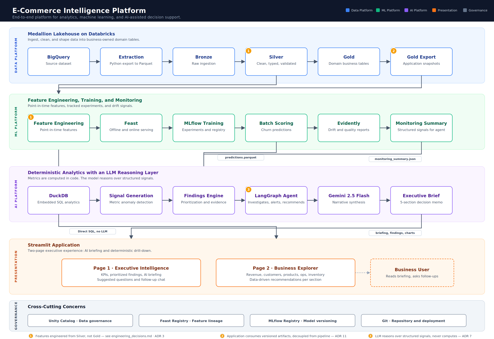
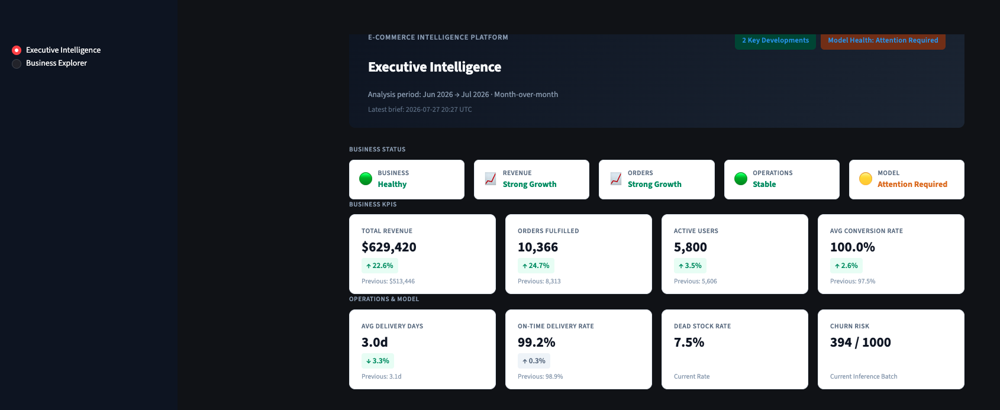
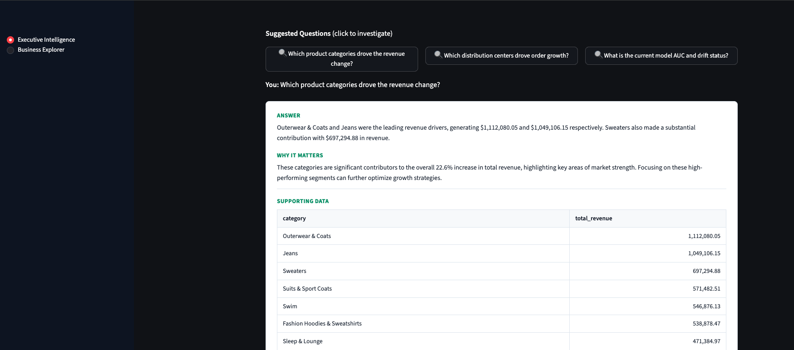
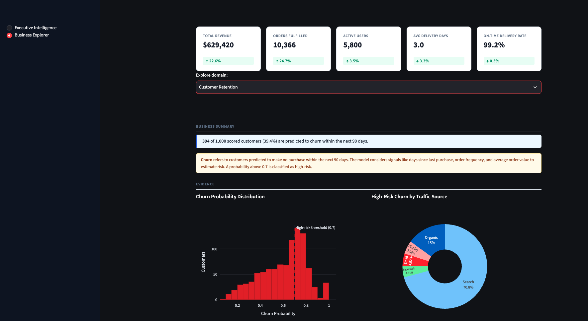

# E-Commerce Intelligence Platform

An end-to-end analytics platform that transforms raw retail data into a governed lakehouse, production machine learning, and an agentic AI system that proactively surfaces business insights and answers executive questions in natural language.

[](https://www.databricks.com/)
[](https://delta.io/)
[](https://www.databricks.com/product/unity-catalog)
[](https://duckdb.org/)
[](https://feast.dev/)
[](https://mlflow.org/)
[](https://www.evidentlyai.com/)
[](https://langchain-ai.github.io/langgraph/)
[](https://cloud.google.com/vertex-ai)
[](https://streamlit.io/)

**[Architecture](docs/architecture.svg)** · **[Engineering Decisions](docs/engineering_decisions.md)** · **[Feature Schema](docs/feature_schema.md)**

## Application Link
https://ecom-ai-intelligence.streamlit.app/

---

## Status

| | |
|---|---|
| ✅ Feature Complete | All pipeline layers, ML lifecycle, agent, and dashboard built and tested |
| ✅ Deployed | Streamlit Community Cloud |
| ✅ Documented | 11 architecture decision records, feature schema with leakage prevention docs |
| ✅ Monitoring | Evidently drift detection across 21 features and prediction distribution |

---

## Design Scope

Most ML portfolio projects stop after training a model. Production systems do not.

| Typical Portfolio Project | This Platform |
|---|---|
| Ends at model training | Continues through monitoring, drift detection, and decision support |
| Dashboard shows charts | AI analyst generates prioritized findings with evidence and recommendations |
| Features from aggregated tables | Point-in-time features from Silver with explicit leakage prevention |
| One notebook, one environment | Governed medallion lakehouse with three schemas and business-owned domain tables |
| Tech demo | Deployed application with a deterministic analytics engine and agentic follow-up |

---

## What This System Does

The platform ingests seven raw e-commerce tables from Google BigQuery through a medallion lakehouse on Databricks, producing five business-owned Gold tables that serve analytics, ML, and an AI agent. A churn prediction model is trained via MLflow, served through Feast, and continuously monitored by Evidently for data and prediction drift.

The AI Business Analyst layer is what sets this apart. A LangGraph agent scans Gold tables and churn predictions, computes structured signals in Python and DuckDB, and generates an executive briefing with prioritized findings, confidence levels, and recommended actions. The LLM never computes a metric. It reasons over pre-computed signals and generates narrative. When an executive asks a follow-up question, the agent translates it to SQL, executes against the Gold tables, and returns a grounded answer with supporting data.

---

## Architecture

<p align="center">
  
</p>

The architecture has four tiers. The **Data Platform** runs the medallion lakehouse from ingestion through Gold export. The **ML Platform** handles point-in-time feature engineering, model training, and monitoring. The **AI Platform** computes signals deterministically and layers LLM reasoning on top. The **Presentation** tier delivers two Streamlit pages, one AI-driven and one pure analytics. Numbered annotations on the diagram link to specific architecture decision records in [`docs/engineering_decisions.md`](docs/engineering_decisions.md).

---

## End-to-End Pipeline

**Data Platform.** Seven tables are extracted from BigQuery to Parquet and uploaded to a Databricks Unity Catalog Volume. Bronze ingests them as-is with metadata columns. Silver applies type enforcement, 13 Delta CHECK constraints, and FK validation across all tables. Gold aggregates Silver into five domain tables: `customer_360` (100K rows, Marketing and CRM), `product_performance` (29K rows, Merchandising), `inventory_health` (29K rows, Supply Chain), `fulfillment_metrics` (903 rows, Operations), and `funnel_analytics` (124K rows, Growth). Gold tables are exported as versioned Parquet snapshots for the application layer.

**ML Platform.** Twenty-two features are engineered from Silver tables with a 90-day prediction window and an explicit temporal cutoff to prevent label leakage. Feast serves features for both offline training and online inference. MLflow tracks nine experiments across three model families. The best model is LightGBM (AUC 0.7417) registered as `ecommerce-churn-model v2`. Evidently runs three monitoring reports comparing training distributions against the latest inference batch.

**AI Platform.** DuckDB reads the Gold Parquet snapshots and computes eight structured signals with month-over-month analysis. A findings engine prioritizes anomalies by severity and attaches evidence chains. A single LangGraph agent with five tools (`kpi_summary`, `sql_query`, `churn_analysis`, `monitoring_status`, `chart_generator`) generates a five-section executive briefing. Mode 2 handles interactive follow-up, translating natural language questions to SQL and returning analyst-style narrative summaries with supporting data tables.

**Presentation.** A two-page Streamlit application. Page 1 (Executive Intelligence) displays the AI-generated briefing, KPI cards with period-over-period deltas, prioritized findings with evidence, and suggested follow-up questions. Page 2 (Business Explorer) runs pure DuckDB queries across five business domains with interactive Plotly charts and data-driven recommendation cards. No LLM is involved on Page 2.

---

## Platform Walkthrough

<p align="center">
  
  <br/>
  <em>Executive Intelligence: AI-generated briefing with business status, KPI cards, and prioritized findings.</em>
</p>

<p align="center">
  
  <br/>
  <em>Follow-up Q&A: the agent translates a question to SQL, executes against Gold tables, and returns a grounded answer with supporting data.</em>
</p>

<p align="center">
  
  <br/>
  <em>Business Explorer: deterministic analytics across five domains, powered by DuckDB with no LLM involvement.</em>
</p>

---

## Design Principles and Trade-offs

Five principles shaped every architectural decision in this project.

**Business-owned data products over table-centric modeling.** Gold tables are organized by domain and owner (Marketing, Merchandising, Supply Chain, Operations, Growth), not by source schema. Business teams think in domains, not in normalized tables.

**Deterministic analytics before generative reasoning.** Every metric, comparison, and severity classification is computed in Python and DuckDB before the LLM sees it. The LLM synthesizes narrative around structured signals. This makes the platform auditable, because every claim in a briefing traces back to a pre-computed signal.

**Point-in-time correctness over offline metric inflation.** Features are engineered from Silver with a temporal cutoff, never from Gold. Gold aggregates across the full observation window, which would leak the label. A 23-user edge case from order-to-item processing lag was caught during validation and preserved as a diagnostic cell in the notebook.

**Architecture matched to problem complexity.** The AI Business Analyst is a single LangGraph agent with five tools, not a multi-agent system. Multi-agent orchestration would add latency and coordination overhead that the problem does not justify. A separate portfolio project uses a multi-agent supervisor pattern where the workflow genuinely requires it.

**Portable open-source components over vendor lock-in.** Feast instead of Databricks Feature Store. DuckDB instead of a managed SQL warehouse. Local Parquet instead of a live connection. Each choice keeps the project reproducible on any machine without a paid subscription.

### Trade-offs

| Decision | Benefit | Trade-off |
|---|---|---|
| DuckDB over a SQL warehouse | Portable, zero-config local deployment | Does not demonstrate warehouse connectivity at scale |
| Feast open-source | Vendor-independent, same API for offline and online | Simpler than an enterprise Redis-backed deployment |
| Local Parquet snapshots | Reliable deployment, no runtime dependency on Databricks | Not real-time, requires a manual export step |
| Single LangGraph agent | Clean reasoning, low latency, fewer failure modes | Less extensible than a multi-agent supervisor |

> **Full documentation:** [Engineering Decisions (11 ADRs)](docs/engineering_decisions.md) · [Feature Schema](docs/feature_schema.md)

---

## Results

| | |
|---|---|
| **Best Model** | LightGBM (`lgb_0.05lr_31lv_100est`), AUC 0.7417, precision 96.2%, recall 75.2% |
| **Model Registry** | `ecommerce-churn-model v2`, MLflow Staging |
| **Data Drift** | 0 of 21 features drifted between training and inference distributions |
| **Prediction Drift** | Detected (Wasserstein distance 5.42), recommendation: INVESTIGATE |
| **Model Quality** | Stable, AUC delta +0.18% on inference batch |
| **Dataset** | TheLook E-Commerce, 7 tables, 3.35M rows |
| **Gold Tables** | 5 domain tables, 283K total rows |
| **Features** | 22 features across 4 groups, 90-day prediction window |
| **Agent** | 8 signals, 3 findings, zero hallucinations verified claim-by-claim |

---

## Repository Layout

```
├── notebooks/                     # Databricks pipeline (Bronze → Silver → Gold)
│   ├── 00_data_exploration.ipynb
│   ├── 01_bronze_ingestion.ipynb
│   ├── 02_silver_transformations.ipynb
│   ├── 03_gold_tables.ipynb
│   ├── 04_feature_engineering.ipynb
│   └── export_gold_tables.ipynb
├── 05_mlflow_training_pipeline.ipynb
├── 06_evidently_monitoring.ipynb
├── 07_ai_business_analyst.ipynb
├── src/
│   ├── analytics/                 # Deterministic engine (signals, findings, DuckDB)
│   │   ├── models.py
│   │   ├── duckdb_setup.py
│   │   ├── signals.py
│   │   └── findings.py
│   └── agent/                     # LangGraph agent (tools, graph, follow-up)
│       ├── tools.py
│       ├── graph.py
│       └── followup.py
├── app/                           # Streamlit application
│   ├── app.py
│   ├── page_executive.py
│   ├── page_explorer.py
│   └── styles.py
├── data/                          # Runtime Gold Parquet snapshots
├── feast/                         # Feature store definitions
├── evidently/                     # Drift reports and monitoring summary
├── docs/                          # Architecture diagram, ADRs, feature schema
└── requirements.txt
```

---

## Run Locally

```bash
# Clone the repository
git clone https://github.com/PrathamHusky07/commerce-intelligence-platform.git
cd commerce-intelligence-platform

# Create and activate the environment
conda create -n lakehouse python=3.11 -y
conda activate lakehouse

# Install dependencies
pip install -r requirements.txt

# Run the Streamlit application
streamlit run app/app.py
```

The application will start on `http://localhost:8501`. The deterministic analytics layer (KPI cards, charts, Business Explorer, recommendations) works immediately from the committed Parquet files.

For the LLM-powered features (executive briefing generation, suggested questions, follow-up chat), you need Google Cloud credentials configured via Application Default Credentials:

```bash
gcloud auth application-default login
```

This requires a GCP project with Vertex AI API enabled. The agent uses `gemini-2.5-flash` and costs are sub-penny per briefing under Google Cloud's free trial credits.

---

## Production Considerations

This project is a portfolio implementation. In a production environment serving a real retail business, several components would evolve. Bronze and Silver would run on scheduled Databricks Workflows with incremental processing rather than full reloads. Gold refreshes would be incremental and partitioned by date. Feast would move to a managed online store backed by Redis or DynamoDB for sub-millisecond feature serving. The DuckDB connection string would point at a Snowflake or BigQuery warehouse rather than local Parquet files, and the query logic would be unchanged. The LangGraph agent would run on a schedule, pushing briefings to Slack or email rather than waiting for a user to open Streamlit. Model registry promotions would require an approval gate. Evidently monitoring would trigger automated retraining pipelines. Infrastructure would be managed through Terraform, and deployments would run through CI/CD rather than manual pushes.

The `Notes on Scope` section in [`docs/engineering_decisions.md`](docs/engineering_decisions.md) documents which production capabilities are intentionally out of scope and what they would replace.
